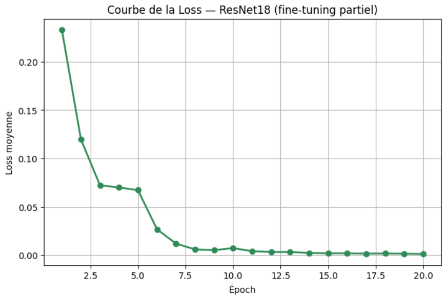
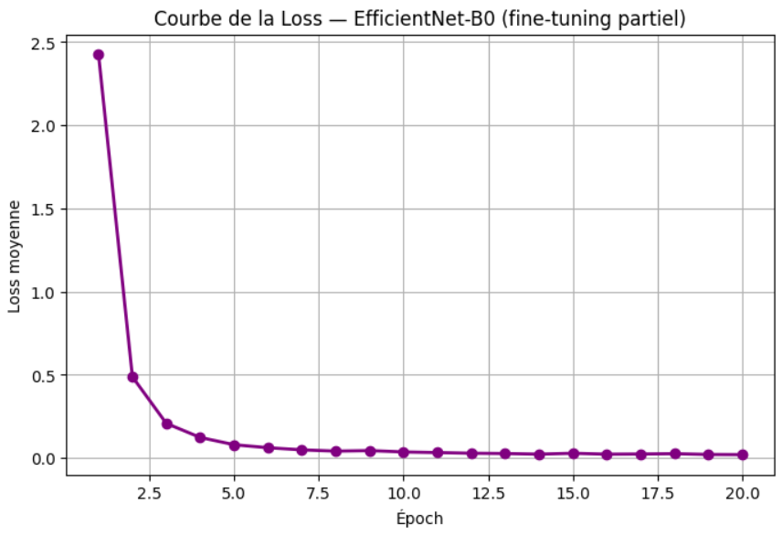
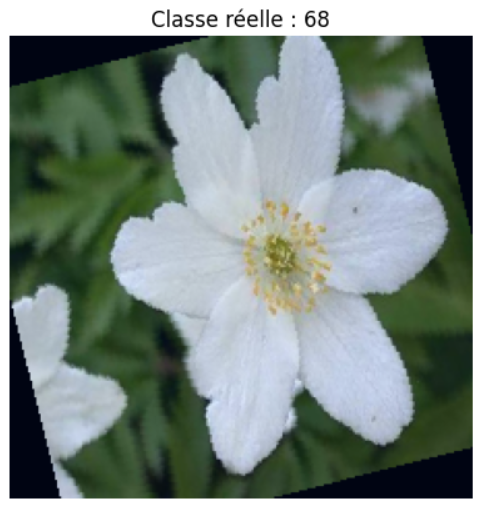
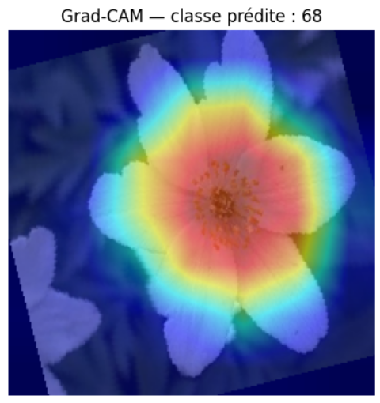

# DeepBloom — From Scratch to Transfer Learning

## 1. Introduction  

This project explores multiple deep learning strategies for **flower image classification** using the **Oxford Flowers102 dataset**.  
The main goal is to compare the progression from **training a CNN from scratch** to applying **transfer learning** with **ResNet18** and **EfficientNet-B0**, and to interpret model behavior using **Grad-CAM** visualizations.

All experiments were conducted with **PyTorch** on **Google Colab**.

---

## 2. Dataset  

**Oxford Flowers102** includes:
- 102 flower species (classes)  
- Approximately 8,000 total images  
- Uneven class distribution  

**Preprocessing:**
- Images resized to 224×224  
- Normalized using ImageNet mean and standard deviation  
- Augmentation: random rotation and horizontal flip  

**Dataset split:**  
Original training, validation, and test sets were merged and then re-split using a **stratified 80/20 split**, ensuring balanced class representation.

---

## 3. Methodology  

### 3.1. CNN from Scratch  

A baseline **Convolutional Neural Network (CNN)** was built manually with:
- Three convolutional + pooling blocks  
- Two fully connected layers  
- ReLU activations and CrossEntropy loss  

**Results:**
- Accuracy: ~39%  
- The network learns but fails to generalize well, limited by dataset size and lack of pretraining.

---

### 3.2. Custom Mini-ResNet  

To understand residual learning, a simplified **ResNet** architecture was built from scratch.  
Each residual block follows:  

$$
\
y = F(x) + x
\
$$

where F(x) represents two convolutional layers.

These **skip connections** mitigate the vanishing gradient problem, allowing deeper models to train effectively.

**Results:**
- Accuracy: ~55–60%  
- Faster and more stable convergence  
- Demonstrates the benefit of residual learning  

---

### 3.3. ResNet18 (Feature Extraction)  

A **ResNet18** pretrained on ImageNet was used as a fixed feature extractor.  
All convolutional layers were frozen, and only the final fully connected layer was retrained for 102 classes.

**Goal:** reuse general visual features learned from ImageNet (edges, textures, shapes).

**Results:**
- Accuracy: ~85%  
- Fast convergence, minimal overfitting  
- Excellent baseline for transfer learning  

---

### 3.4. ResNet18 (Partial Fine-Tuning)  

Layers `layer3`, `layer4`, and `fc` were unfrozen to allow partial fine-tuning, adapting deeper features to flower-specific patterns.  

**Training setup:**
- Optimizer: Adam  
- Learning rate: 3e-4  
- Scheduler: StepLR (gamma=0.5 every 5 epochs)

**Results:**
- Final loss: 0.0013  
- Accuracy: **97.86%**

The model converged smoothly and achieved excellent generalization.  
Skip connections preserved stable gradient flow during training.

**Loss curve (ResNet18):**  

---

### 3.5. EfficientNet-B0 (Partial Fine-Tuning)  

**EfficientNet-B0** was tested to benchmark a newer, more efficient architecture.  
It uses **compound scaling**, which balances network depth, width, and resolution to maximize efficiency.  

Layers `features.6`, `features.7`, and `classifier` were unfrozen for adaptation.

**Training setup:**
- Optimizer: Adam  
- Learning rate: 3e-4  
- Scheduler identical to ResNet18  

**Results:**
- Final loss: 0.02  
- Accuracy: **97.50%**  

**Analysis:**  
EfficientNet converged rapidly and achieved nearly identical accuracy with half the number of parameters (~5.3M vs. 11.7M).  
Its smaller size makes it better suited for deployment scenarios.

**Loss curve (EfficientNet-B0):**  

---

## 4. Model Benchmark  

| Model | Training Type | Accuracy | Parameters (M) | Remarks |
|:--|:--|:--:|:--:|:--|
| CNN (scratch) | From scratch | 0.39 | 2.0 | Educational baseline |
| Mini-ResNet | From scratch | 0.55–0.60 | 4.0 | Stable and faster convergence |
| ResNet18 (feature extraction) | Transfer learning | 0.85 | 11.7 | Fast and stable |
| **ResNet18 (partial fine-tuning)** | Transfer learning | **0.9786** | 11.7 | Excellent accuracy, stable learning |
| **EfficientNet-B0 (partial fine-tuning)** | Transfer learning | **0.9750** | **5.3** | Lighter and efficient |

---

## 5. Grad-CAM Visualization  

**Grad-CAM (Gradient-weighted Class Activation Mapping)** highlights the image regions that most influence the model’s decision.  

### Mechanism:
1. Compute gradients of the target class score with respect to the activations of a convolutional layer.  
2. Weight each feature map by its corresponding average gradient.  
3. Combine them into a single activation map.  
4. Apply ReLU to keep only positive contributions and overlay the result on the image.  

**Example:**  

Original image:  

Grad-CAM visualization:  

**Interpretation:**  
The red and yellow zones correspond to the most influential regions for classification.  
Both ResNet18 and EfficientNet focused on the flower’s center and petals, confirming correct attention and robust feature learning.

---

## 6. Discussion  

### 1. Impact of Transfer Learning  
Transfer learning dramatically improves performance: accuracy increased from 39% (scratch) to nearly 98%.  
Pretrained networks leverage generic visual representations learned on ImageNet, saving time and computation.

### 2. Partial vs. Full Fine-Tuning  
Unfreezing only the top layers achieves near-perfect accuracy while keeping training efficient and stable.  
Full fine-tuning is unnecessary on small datasets like Flowers102.

### 3. ResNet vs. EfficientNet  
ResNet18 slightly outperforms EfficientNet-B0 in accuracy but at twice the model size.  
EfficientNet offers a much better efficiency-to-performance ratio for deployment contexts.

### 4. Interpretability  
Grad-CAM visualizations confirm that the models learn meaningful spatial patterns rather than background artifacts, supporting model reliability.

---

## 7. Conclusion  

This project demonstrates the progression of CNN-based vision models:
- Simple CNNs provide foundational understanding but limited results.  
- Residual architectures (ResNet) significantly improve gradient propagation and convergence.  
- Transfer learning using pretrained models (ResNet18, EfficientNet-B0) achieves state-of-the-art accuracy with minimal data and training time.  
- Grad-CAM adds interpretability by revealing what the network “sees.”

**Best-performing model:** ResNet18 (partial fine-tuning) with **97.86% accuracy**.

---

## 8. Future Work  

- Experiment with **EfficientNet-B2/B4** for improved scaling.  
- Implement advanced data augmentation (MixUp, CutMix).  
- Explore **quantization and pruning** for mobile deployment.  
- Evaluate robustness to distortions (blur, noise, rotation).  

---

### References  

- K. He et al., *"Deep Residual Learning for Image Recognition"*, CVPR 2016.  
- M. Tan and Q. Le, *"EfficientNet: Rethinking Model Scaling for Convolutional Neural Networks"*, ICML 2019.  
- Oxford VGG Group, *"The Oxford 102 Flower Dataset"*.

